# Snackbox


A small collection of casual games built in Godot 4.

```sh
task run        # play
task install    # build and drop Snackbox.app in /Applications
task --list     # everything else
```

Press `F` for fullscreen, `Esc` to return to the menu from any game.

**Seeds.** Fence, Linkup, Shapes, Gridlock and Decant all show a four-character
seed. Everyone gets the same one each day, so you can compare scores on the same
board — press `S` to type someone else's and play theirs instead.

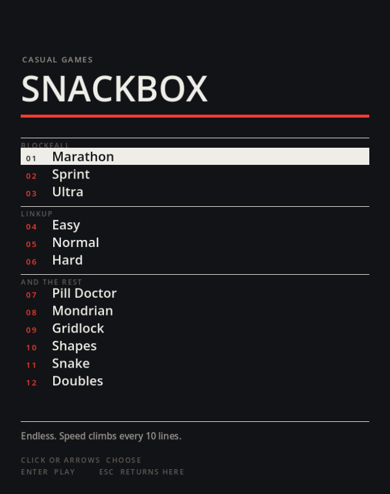

## Blockfall

Falling blocks, in three modes: **Marathon** runs forever and speeds up every 10
lines, **Sprint** is a race to clear 40, and **Ultra** is as many points as you
can manage in two minutes.

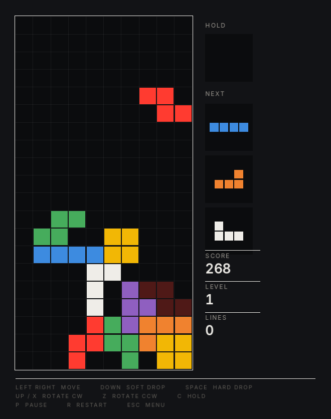

`← →` move · `↓` soft drop · `Space` hard drop · `↑`/`X` rotate · `Z` rotate back
· `C` hold · `P` pause

## Linkup

Join each pair of dots without crossing, and keep going until every square on
the board is used. Easy, Normal and Hard change how big the boards get and how
many colours share them.

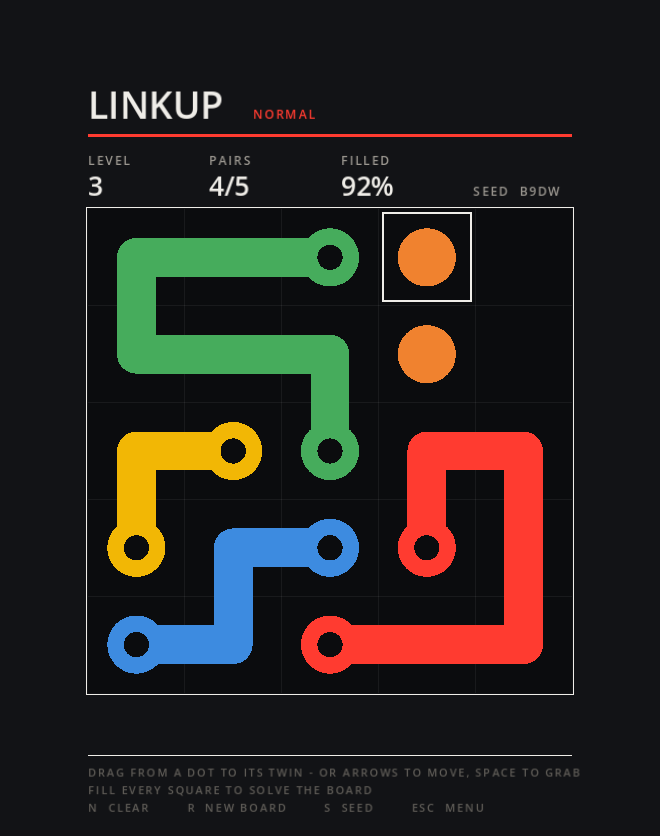

Drag with the mouse, or `← → ↑ ↓` to move and `Space` to grab · `N` clear ·
`R` new board

## Pill Doctor

Drop two-tone pills into the bottle and line up four or more of a colour to wipe
them out. Clearing a match drops whatever was resting on it, which can set off
chains. Clear every virus to move on.

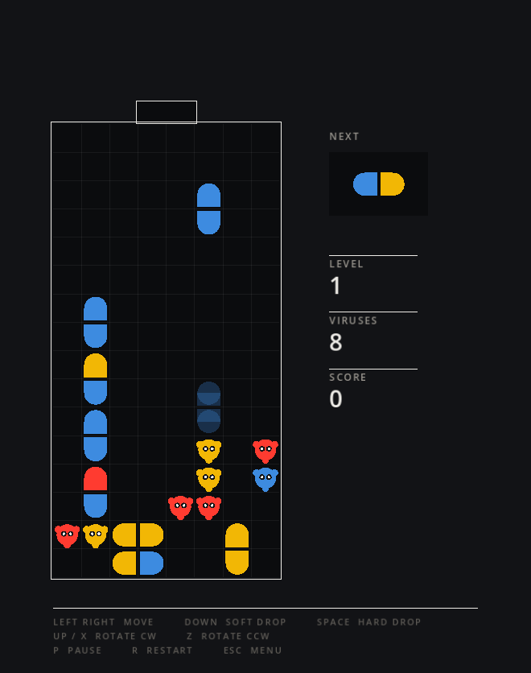

`← →` move · `↓` soft drop · `Space` hard drop · `↑`/`X` rotate · `Z` rotate back
· `P` pause

## Mondrian

Cut into open space to draw a trail, then get back to solid ground to seal it
off. Any pocket the drifters aren't in becomes yours — and every sealed region
is painted flat in one of Mondrian's colours and outlined in heavy black, so the
board composes itself into a painting as you claim it. Reach 75% to clear the
level.

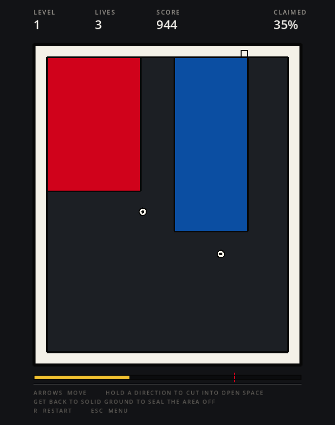

`← → ↑ ↓` move · `R` restart

## Gridlock

A traffic jam. Cars and trucks only move along their own axis; shuffle them
until the red car can reach the gap on the right.

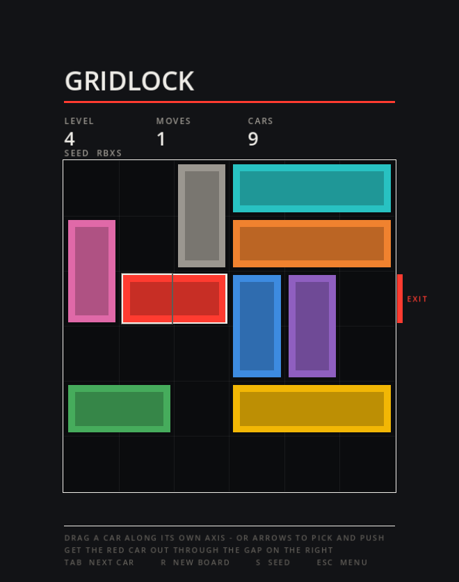

Drag a car along its axis, or `Tab` to pick and `← → ↑ ↓` to push · `R` new board

## Shapes

Carve the grid into rectangles. Every rectangle must hold exactly one clue and
match what it asks for — a square, a tall rectangle, a wide one, or any of the
three — and a clue carrying a number fixes its area too.

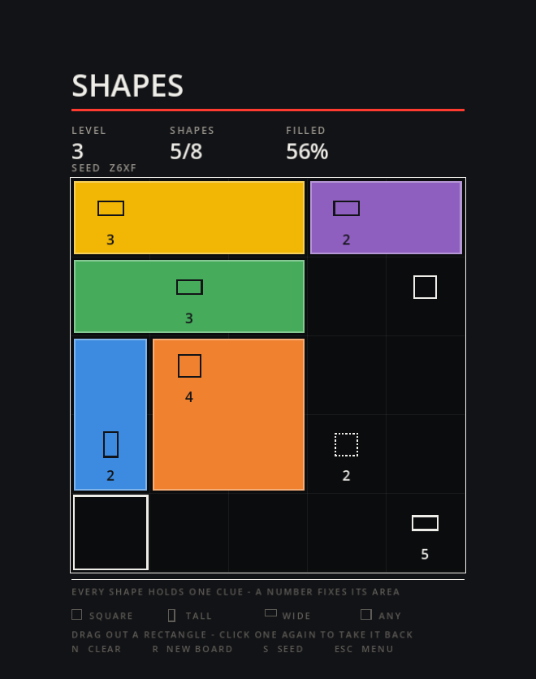

Drag out a rectangle, click one again to take it back · `N` clear · `R` new board

## Fence

An original one. You get a fixed length of fence — draw a **closed loop** along
the grid lines, and everything inside it is yours, the good cells and the bad
ones alike.

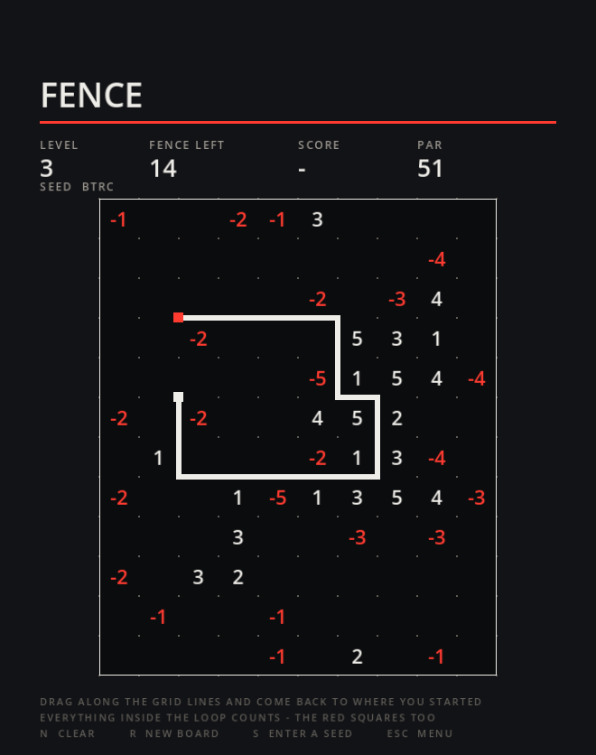

That single rule is the whole game: a tight loop is cheap but misses things, a
sprawling one reaches everything and runs out of fence. Every level has a par,
which is the shape the board was built around — so the target is known to be
reachable rather than guessed at. Beating it is allowed.

Drag along the grid lines and come back to where you started · `N` clear ·
`R` new board

## Pyramid

Solitaire. Clear the pyramid by pairing cards that add to 13 — ace is 1, so a
king goes on its own. A card is only free once both cards resting on it are
gone. Three passes through the stock.

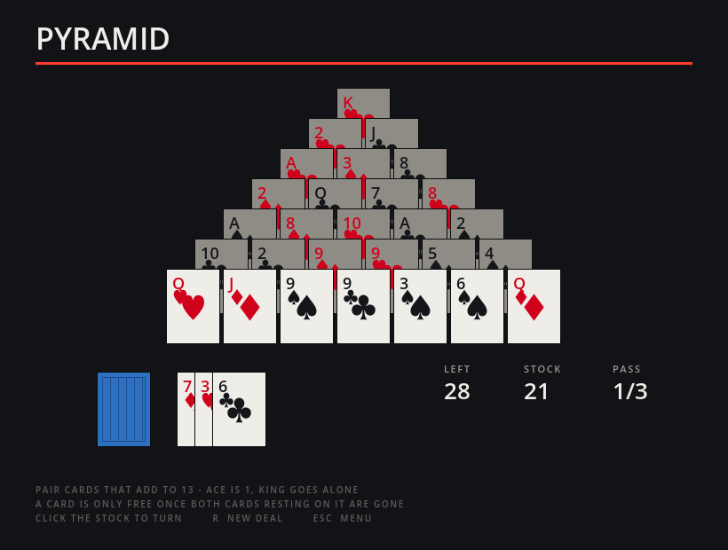

Click a card to pick it, click its partner to take the pair · click the stock to
turn · `R` new deal

## Decant

Pour between tubes until each one holds a single colour. A pour needs an empty
tube or the same colour already on top, and it moves the whole run of matching
liquid — or as much of it as fits.

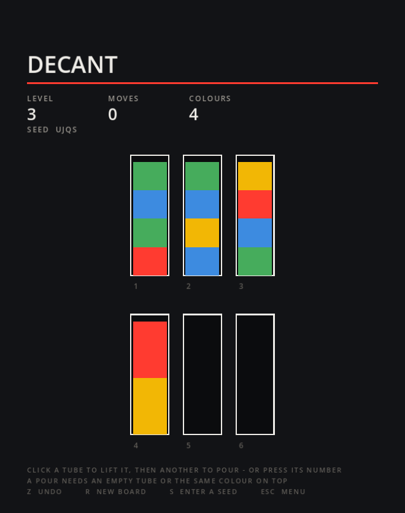

Click a tube to lift it, then another to pour, or press its number · `Z` undo ·
`R` new board

## Snake

Eat, grow, don't run into the walls or yourself. It speeds up as you get longer.

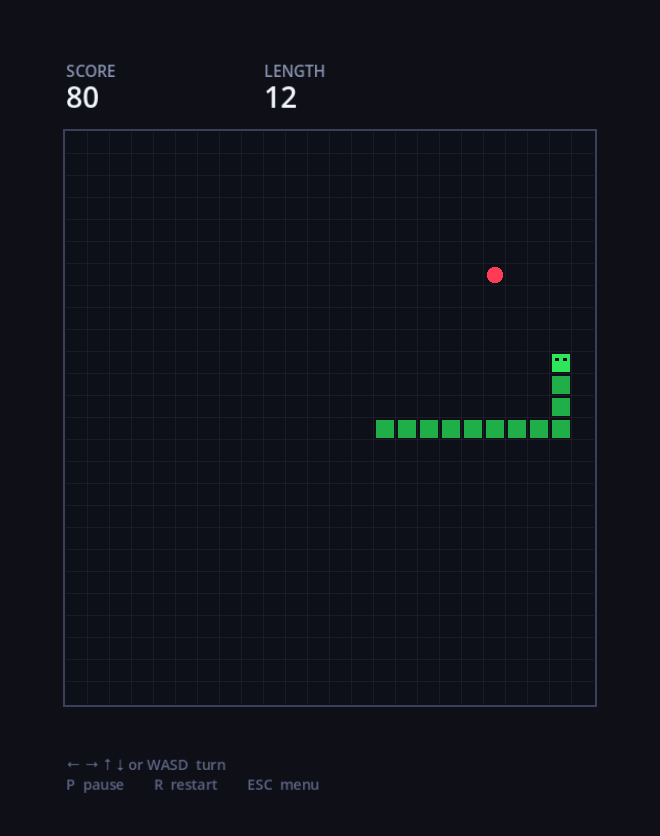

`← → ↑ ↓` or `WASD` turn · `P` pause · `R` restart

## Doubles

Slide the whole board one way and equal tiles fuse, though each tile only fuses
once per move. Reach 2048, then keep going until the board locks up.

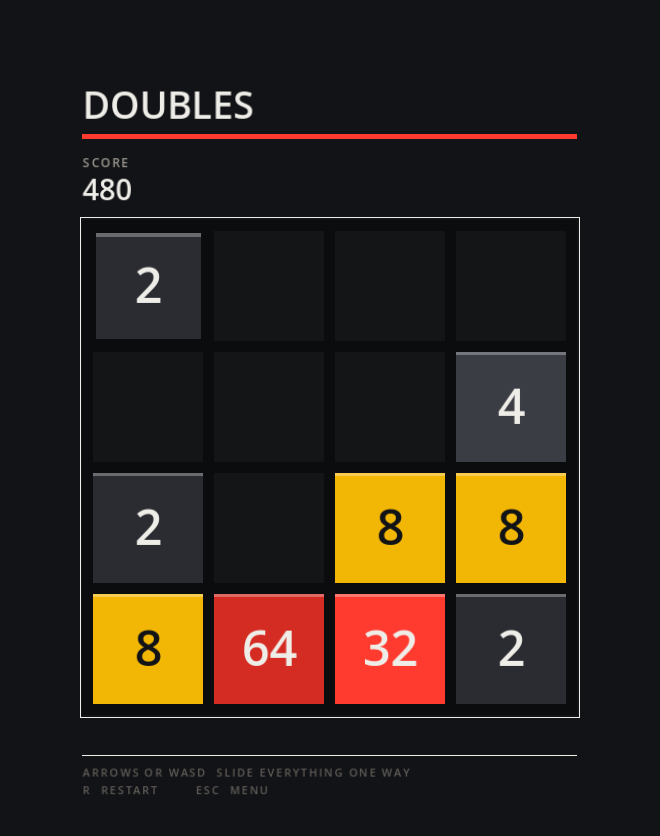

`← → ↑ ↓` or `WASD` slide · `R` restart

## License

MIT — see [LICENSE](LICENSE).
