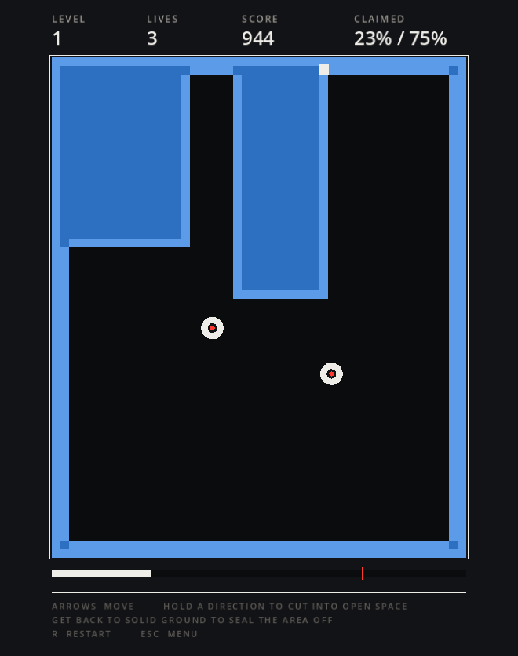

# Snackbox

A small collection of casual games built in Godot 4. GDScript only, no external
assets — every board, piece, virus and panel is drawn procedurally.

Screenshots below are generated, not captured — `task shots` plays each game
with a seeded set of moves and saves the rendered frame, so they always show
real boards and never drift out of date.


## Running

Open the folder as a project in Godot 4.4+ and press F5, or:

```sh
task run                       # run it
task test                      # play every game headlessly, check invariants
task install                   # build and drop Snackbox.app in /Applications
task --list                    # everything else
```

Jump straight into a game while developing:

```sh
task run -- --game=landgrab
```

## The games

### Blockfall

Falling blocks. SRS rotation with the full wall-kick tables, 7-bag randomizer,
hold, ghost piece, lock delay with move resets, and DAS/ARR repeat.

| Mode | Goal |
| --- | --- |
| Marathon | Endless. Speed climbs every 10 lines. |
| Sprint | Clear 40 lines as fast as possible. |
| Ultra | Score as much as you can in 2 minutes. |


Controls: `← →` move, `↓` soft drop, `Space` hard drop, `↑`/`X` rotate cw,
`Z` rotate ccw, `C` hold, `P` pause, `R` restart, `Esc` menu.

### Pill Doctor

Drop two-tone pills into the bottle and line up four or more of a colour to wipe
them out. Clearing a match drops whatever was resting on it, which can set off
chains. Clear every virus to advance; each level adds viruses and stacks them
higher.


Controls: `← →` move, `↓` soft drop, `Space` hard drop, `↑`/`X` rotate cw,
`Z` rotate ccw, `P` pause, `R` restart, `Esc` menu.

### Snake

Eat, grow, don't run into the walls or yourself. Speeds up as you get longer.


Controls: `← → ↑ ↓` or `WASD` turn, `P` pause, `R` restart, `Esc` menu.

### Doubles

Slide the whole board one way; equal tiles fuse. Each tile only fuses once per
move. Reach 2048, then keep going until the board locks up. Tiles animate along
the path they actually travelled, and merges bump as their halves land — the
grid reaches its final state immediately, so input never waits on the
animation.


Controls: `← → ↑ ↓` or `WASD` slide, `R` restart, `Esc` menu.

### Linkup

Join each pair of dots without crossing, and keep going until every square is
used. Drag with the mouse, or move the cursor with the arrows and grab with
space.


Levels are generated backwards from a solution, which is what guarantees they
can be finished: build a Hamiltonian path over the whole grid, randomise it
with backbite moves, then cut it into runs. Each run is one colour's route and
its ends are the dots — so laying every route back down fills the board
exactly. Boards grow from 5×5 to 8×8.

Controls: mouse drag, or `← → ↑ ↓` move and `Space` grab. `N` clear, `R` new
board, `Esc` menu.

### Landgrab

Qix style area claiming. Hold a direction to cut into open space, then get back
to solid ground to seal the cut. Any pocket the drifters aren't in becomes
yours. Claim 75% to clear the level. Getting clipped while exposed — on your
trail or at its tip — costs a life.



Controls: `← → ↑ ↓` move, `R` restart, `Esc` menu.

## Look

Flat colour, no bevels or gradients, a strict left margin, hairline rules, and
uppercase labels set small and letter-spaced above large figures — the
International Typographic ("Swiss modern") manner, on a dark ground with a
single red accent. The palette lives in `blocks.gd`; the games reference it by
name rather than hard-coding colours, so retheming is one file plus each game's
handful of functional colours.

## Layout

| File | Purpose |
| --- | --- |
| `main.gd` / `main.tscn` | App shell: window sizing, menu, screen swapping |
| `menu.gd` / `menu.tscn` | Game picker |
| `blocks.gd` | Shared palette and drawing helpers |
| `game.gd` / `game.tscn` | Blockfall (all three modes) |
| `pills.gd` / `pills.tscn` | Pill Doctor |
| `landgrab.gd` / `landgrab.tscn` | Landgrab |
| `snake.gd` / `snake.tscn` | Snake |
| `doubles.gd` / `doubles.tscn` | Doubles |
| `linkup.gd` / `linkup.tscn` | Linkup |
| `scores.gd` | Persistent bests, shared by every game |
| `tests/smoke.gd` | Headless test suite |
| `tests/shot.gd` | Renders screenshots for the README |
| `scripts/test.sh` | Test runner, with the watchdog |
| `Taskfile.yml` | Run, test, build, install |

Each game is an independent scene that draws itself and emits `exit_to_menu`.
They share the drawing helpers in `blocks.gd` and nothing else — the boards and
rules have little in common, and forcing a shared abstraction would cost more
than it saves. Adding a game means dropping in a scene, adding a row to
`Menu.ENTRIES`, and an entry in `Main.GAMES`.

## High scores

Bests persist in `user://scores.cfg` and show in each game's HUD. Scores are
"higher is better"; Sprint records a time instead, and only when the line goal
was actually reached rather than when the run topped out.

## Tests

`task test` drives every game with a fixed timestep and random input for
thousands of simulated frames, checking invariants continuously: pieces never
overlap the stack, pill halves always keep a matching partner, virus counters
match the board, the player never stands on unclaimed space. It also runs
deterministic scenarios: pill clears and chains, sealing a Landgrab pocket,
snake growth and wall death, and twelve exact-board assertions covering
Doubles' merge rules (pairs fuse, four-of-a-kind makes two tiles not one, a
tile never fuses twice in a move, a settled row reports no movement).

## License

MIT — see [LICENSE](LICENSE).
